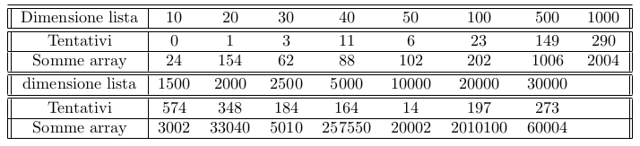

# PerfectHashing
Assioma Andrea Aligi\
13 Gennaio 2022
## 1. Introduzione
Nella seguente relazione si indiviudua l’hash perfetto, attraverso lo sviluppo di
un programma che parte dall’implementazione dell’hash universale.\
\
La tabella hash è una struttura dati usata per implementare dizionari, cioè
un insieme dinamico che supporta operazioni di inserimento, cancellazione e
ricerca.\
L’hash perfetto rappresenta una funzione h(k) che permette di salvare una lista
lunga di chiavi k in una tabella hash di dimensioni minori della quantità di chiavi da memorizzare |K|. Si ha, inoltre, una minor probabilità (più bassa dello
0.5) di collisioni tra chiavi con stesso hashing.\
La struttura è caratterizzata da due livelli di hashing, ciascuno di tipo universale. Quest’ultimo permette di randomizzare la funzione hash in modo che sia
indipendente dalle chiavi che verranno salvate.\
Il primo livello è simile all’hashing concatenato ma, invece che creare una lista
collegata per hash uguali in uno slot i, si usa una tabella hash secondaria Si a
cui si associa una funzione hash hi (secondo livello).\
Per evitare collisioni nel secondo livello, si verifica che la dimensione mi della
tabella Si sia il quadrato del numero di chiavi $n_i$ memorizzate in $i$.\
\
Nel programma si farà in modo che nella tabella secondaria non si creino collisioni e, quindi, che la ricerca di ogni elemento inserito avvenga con successo.
### 1.1 Hardware e Sistema operativo
Le piattaforme sui cui verrano effettuati gli esperimenti sono:
* Un pc fisso con processore i5-10600k e 16gb di ram. Il sistema operativo
adoperato è Ubuntu 20.04.
* Un portatile con processore M1 e 8 gb di ram. Il sistema operativo adop-
erato è OS Monterey.
<!---->
Non in tutti gli esperimenti sono stati usati entrambi.
## 2. Creazione hash universale
Prima di introdurre l’hash perfetto, si parte dalla creazione dell’hash universale.
Si considera, perciò, un numero primo p t.c. ∀ chiave k si ha 0 ≤ k ≤ p-1 (quindi
p deve essere maggiore della chiave più grande). Inoltre, si sceglie a e b naturali
t.c. $0 ≤ a ≤ p-1$ e $0 ≤ b ≤ p$. La funzione hash sarà
$h_{a,b} = ((a × k + b)mod \ p)mod \ m$ dove $mod$ indica il modulo. Scegliendo in
maniera casuale a e b, si ha una famiglia con (p-1)p funzioni hash diverse per
un determinato valore di m.
### 2.1 Creazione hash perfetto
Una volta introdotto il concetto di funzione hash universale, si può realizzare
l’hash perfetto.\
Inserendo per ciascuna run una lista casuale (con valori compresi tra 0 e n-1 dove
n indica la dimensione della lista) di dimensioni diverse (rispettivamente 10, 20,
30, 40, 50, 100, 500, 1000, 1500, 2000, 2500, 5000, 10000, 20000, 30000), per
ciascuna si è stimato l’hash perfetto, la dimensione totale degli array generati
e il numero di tentativi effettuati prima di ottenere una funzione hash senza
collisioni.\
Per il seguente esperimento sono state realizzate due classi:
* **secondHashTable** è la classe che implementa la tabella hash di secondo
livello. Nel momento in cui viene inizializzata, se nello stesso slot della
tabella primaria viene inserito solo un valore (determinato tramite apposito array ”ausiliario” C[i] il quale conta quanti valori hanno stesso
hashing in uno slot i della tabella primaria), la dimensione della tabella
m di secondo livello sarà uguale a 1 e a e b avranno valore 0 e conterrà
solo quel valore da inserire. Altrimenti, le dimensioni della tabella saranno
uguali al quadrato della quantità di valori con stesso hash e a e b assumeranno altri valori (sempre compresi nel range specificato nel paragrafo 2.).
Le chiavi, infine, verranno inserite nella tabella secondo un’altra funzione
hash.\
Come input prende il numero di elementi che hanno stesso hash in un
determinato slot C[i] e il valore primo p (determinato moltiplicando per
due la dimensione della tabella del primo livello, più uno: è risultato il
modo più veloce per determinare un valore primo che fosse maggiore della
chiave con valore più grande).
* perfectHashing rappresenta la classe che realizza l’hashing perfetto. La
maggior parte delle operazioni sono state effettuate nel costruttore.\
Gli attributi implementati nel codice sono:
    * p, a e b definiti precedentemente.
    * S rappresenta invece, la tabella hashing di primo livello. Una volta
      determinata la quantità di chiavi che vengono inserite per ciasucno
      slot, si realizzano le rispettive tabelle hashing di secondo livello connesse ad essa.
<!---->
Gli unici due metodi implementati sono serviti per avere una visione più
chiara del codice e sono
* **insertSecondHash** che inserisce la chiave data in input nella tabella
hash di secondo livello, sempre data in input, inizializzata precedentemente.
* **searchElements** il quale verifica che tutti gli elementi dell’array dato
in input siano stati inseriti correttamente. Come input prende l’array
iniziale. Come output, invece, ritorna _True_ in caso la ricerca sia
avvenuta con successo, altrimenti ritorna _False_.
### 2.2 Conclusioni a priori
Trattandosi dell’hashing perfetto, ci si può aspettare una probabilità di collisione
minore di 1/2. Però, aumentando di dimensioni la lista a cui applicare l’hashing,
ci si può aspettare anche delle run che impiegano più tempo nell’organizzare le
tabelle di primo e secondo livello.\
Per quanto riguarda la somma delle dimensioni di tutti gli array generati e il
numero di tentativi, è difficile trarne delle conclusioni precise in quanto in ogni
run la lista data in input, a, b e p assumono valori diversi. Perciò più la lista
è lunga, più le combinazioni aumentano e più può aumentare la quantità di
tentativi da effettuare.
### 2.3 Esito degli esperimenti
L’esito degli esperimenti sono riportati nella seguente tabella\
\
Per avere un’idea più chiara sull’andamento degli esiti degli esperimenti, si
può realizzare grafico\
\
\
Come si può notare dai due grafici, non è possibile trarre alcuna correlazione
tra il numero di tentativi effettuati e la somma di tutti gli array. Però si può
notare come, all’aumentare della dimensione della lista, i valori possono essere
altalenanti (come nel caso della lista di 1500 elementi che ha richiesto 574 tentativi per avere un hash perfetto senza collisioni). Da notare anche che è stato
imposto il limite della lunghezza della lista a 30000 in quanto è capitato, per
quest’ultimo, un tempo di esecuzione superiore ai 5 minuti: per questo è stato
interrotto forzatamente. Al secondo tentativo di run, infatti, ha elaborato i
risultati più velocemente.\
Riguardo la ricerca, non avendo collisioni, ha complessità O(1).